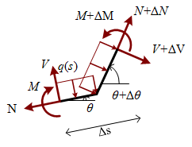

# Afleiding differentiaalvergelijking balk

Gegeven een balk met assenstelsel met as $s$ langs de as en as $z$ loodrecht op de as, verdeelde belasting $q \left(s \right)$ loodrecht op de as, richting $\theta \left( s \right) $ tov de horizontaal en op de uiteindes normaalkracht $N \left(s \right)$, dwarskracht $V \left( s \right)$ en moment $M \left( s \right)$:

Alle grootheden kunnen singulariteiten bevatten in de vorm van sprongen (Heaviside-functie $H \left( s\right)$)

Doel is differentiaalvergelijking op te stellen zonder overgangsvoorwaarden.

## Zonder singulariteiten

Balkelementje van lengte $\Delta s$:

### Krachtenevenwicht langs as:
$$ -N + N + \Delta N = 0$$
geeft
$$ \Delta N = 0 $$
(als inclusief belasting langs as is het resultaat ${dN \over ds} = q_s$

### Krachtenevenwicht loodrecht op as:
$$ - V + q\left( s \right)\Delta s + V + \Delta V = 0$$
geeft
$${{\Delta V} \over {\Delta s}} =  - q\left( s \right)$$
$${dV \over ds} =  - q\left( s \right)$$

### Momentenevenwicht loodrecht op as rondom rechter snede:
$$ - V \Delta s -M + q \left( s \right) \Delta s {1 \over 2} \Delta s + M + \Delta M = 0 $$
$${{\Delta M} \over {\Delta s}} =  V$$
$${dM \over ds} =  V$$

## Met singulariteiten

Balkelementje van lengte $\delta s$ met singulariteit in $\theta s$ 

Singulariteiten in $q(s)$ vormen geen problemen en zorgen eveneens voor singulariteiten in $N(s)$, $V(s)$ en $M(s)$. Het is onduidelijk hoe om te gaan met singulariteiten in $\theta (s)$

### Krachtenevenwicht langs beginrichting as:
$$ -N + (N + \Delta N) \cos ( \Delta \theta) + \underbrace {q (s) {1 \over 2} \Delta s \sin(  \Delta \theta )}_{?} + (V + \Delta V)  \sin(  \Delta \theta)  = 0$$
geeft
$$???$$

Onduidelijk hoe om te gaan met singulariteit binnen oneindig klein balkelementje.

En hetzelfde drama voor de andere evenwichten